# Constructional Affection Coach

Constructional Affection Coach is an AI-assisted interview and program-building platform for creating individualized Constructional Affection programs.

The application combines a responsive SvelteKit client, a serverless AWS backend, structured AI workflows, persistent user programs, and an emerging MCP integration in a single Nx-managed monorepo.

<p align="center">
  <a href="https://constructionalaffectioncoach.com">
    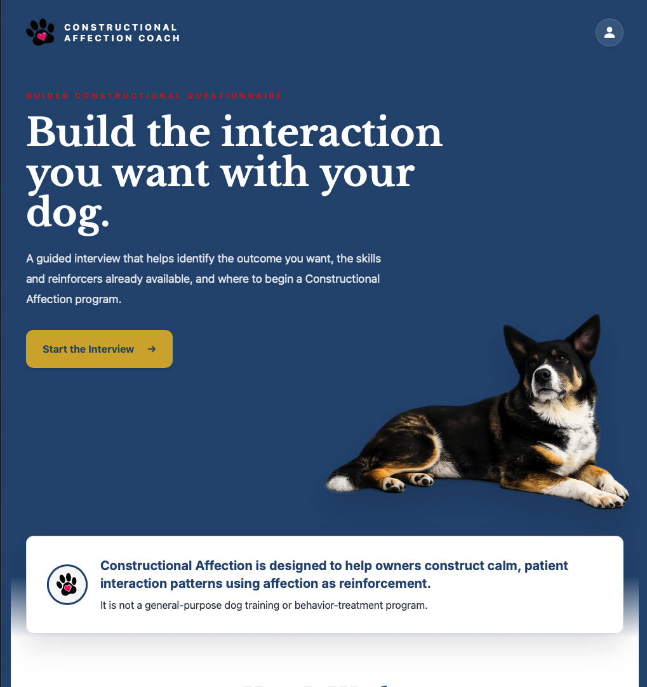
  </a>
</p>

<p align="center">
  <a href="https://constructionalaffectioncoach.com"><strong>View the live application</strong></a>
</p>

## Product Experience

The application guides a user from a desired interaction, through existing constructional assets and the interaction chain, to a structured starting program.

### Guided Interview

<p align="center">
  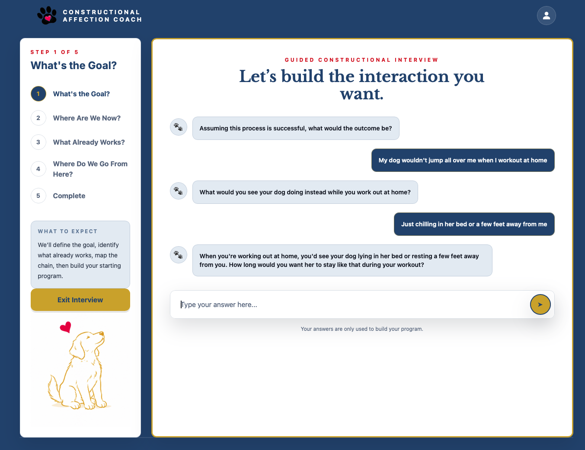
</p>

The interview is organized into explicit phases rather than operating as an unrestricted chatbot. Each phase collects and transforms information required to construct the final program.

### Program Generation

<p align="center">
  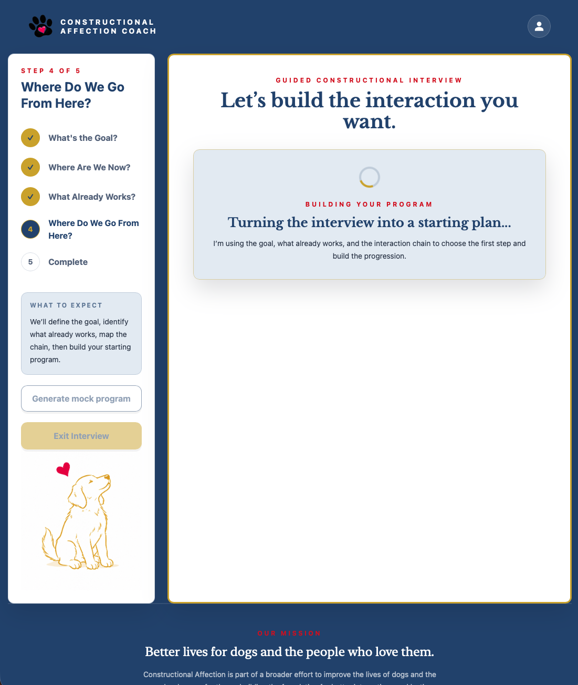
</p>

After the interview is complete, the application uses the defined goal, existing assets, reinforcers, and interaction chain to construct the program's starting point and progression.

### Program Completion

<p align="center">
  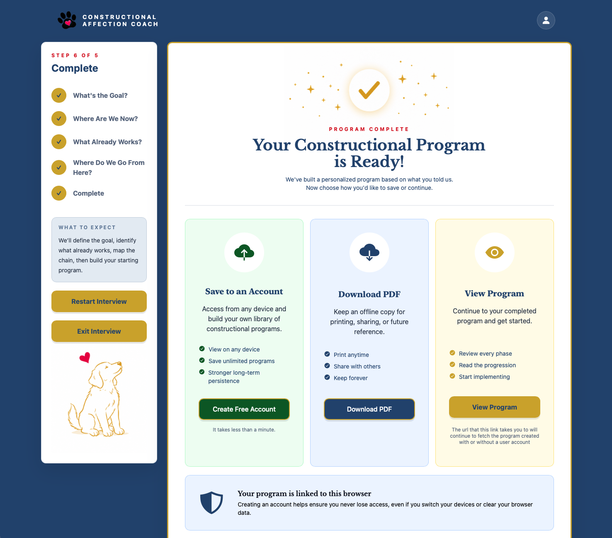
</p>

Users can create an account, download a PDF, or continue directly to the completed program.

### Completed Program

<p align="center">
  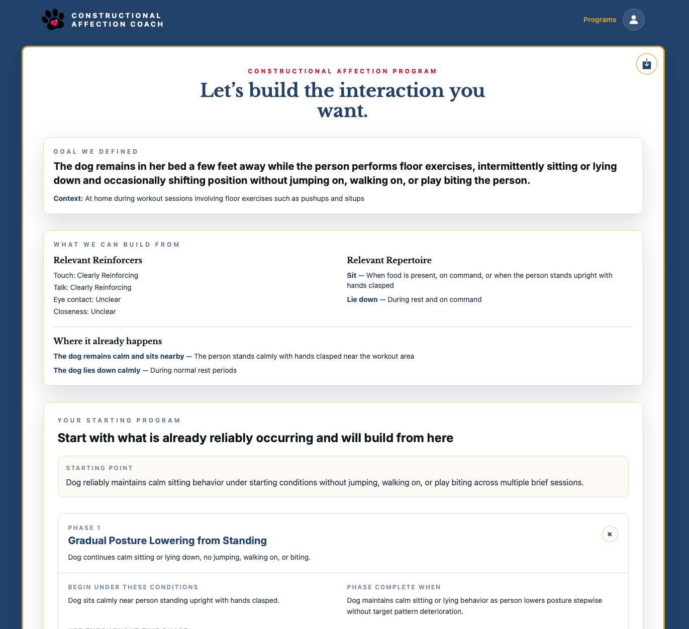
</p>

The completed program preserves the target outcome, relevant reinforcers and repertoire, existing interaction assets, the constructional starting point, and progressive program phases.

### Accounts and Saved Programs

<table>
  <tr>
    <td width="50%" valign="top">
      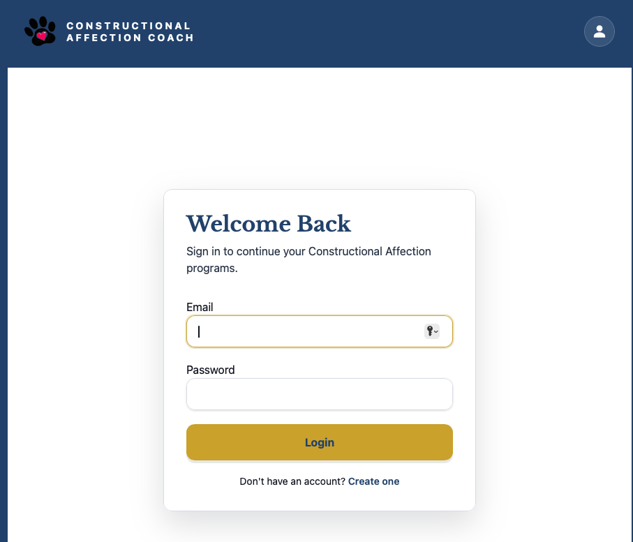
      <p align="center"><strong>Authentication</strong></p>
    </td>
    <td width="50%" valign="top">
      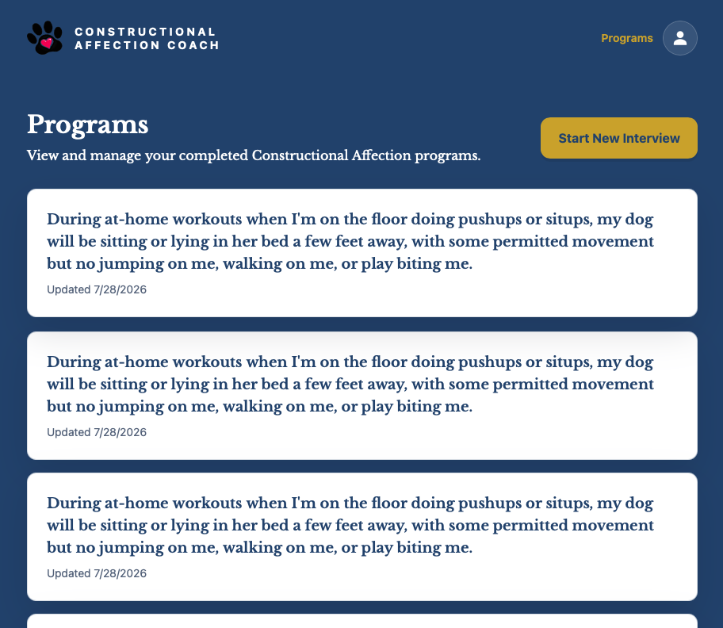
      <p align="center"><strong>Saved programs</strong></p>
    </td>
  </tr>
</table>

Amazon Cognito provides authenticated accounts, while DynamoDB persistence allows completed programs to be associated with a user and retrieved later.

### Responsive Experience

<table>
  <tr>
    <td width="38%" valign="top">
      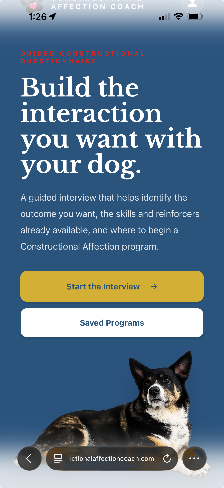
    </td>
    <td width="62%" valign="middle">
      <h4>Responsive across desktop and mobile</h4>
      <p>The client adapts the interview, navigation, program library, and generated-program experience for smaller screens without changing the underlying workflow.</p>
    </td>
  </tr>
</table>

## Architecture

The repository is organized as a monorepo containing the client application, backend services, AWS infrastructure, domain packages, and MCP tooling.

```text
constructional-affection/
├── constructional-affection-coach/   # SvelteKit client
├── domain/                            # Shared domain models and schemas
├── lambdas/                           # AWS Lambda services
├── infra/                             # AWS CDK infrastructure
├── mcp/                               # MCP server and tools
├── .github/                           # CI/CD workflows
├── Dockerfile
├── nx.json
└── package.json
```

Nx coordinates development, builds, type checking, linting, and tests across the workspace.

## Applications and Packages

### Client

`constructional-affection-coach/`

The user-facing application is built with:

- SvelteKit
- TypeScript
- Tailwind CSS
- Vitest

The client provides:

- guided Constructional Affection interviews
- structured multi-phase interview progression
- authenticated user accounts
- saved programs
- program viewing
- PDF export
- responsive desktop and mobile interfaces

### Domain

`domain/`

The domain package contains shared types, Zod schemas, interview-phase contracts, and version metadata used across the client, Lambda services, and MCP implementation.

### Lambda Services

`lambdas/`

Node.js and TypeScript Lambda functions provide the application's serverless backend.

Responsibilities include:

- creating interviews
- retrieving interviews and programs
- associating interviews with authenticated users
- orchestrating interview phases
- generating programs
- interacting with the OpenAI API
- validating structured AI responses
- retrying recoverable failures
- persisting application state in DynamoDB

The orchestration layer manages deterministic application behavior around probabilistic model behavior rather than acting as a simple proxy to the OpenAI API.

### Infrastructure

`infra/`

AWS infrastructure is defined with the AWS CDK and deployed as infrastructure as code.

The production architecture includes:

- Amazon API Gateway
- AWS Lambda
- Amazon DynamoDB
- Amazon Cognito
- Amazon S3
- Amazon CloudFront
- AWS Certificate Manager
- AWS Secrets Manager
- Amazon CloudWatch
- AWS IAM

The client is distributed through CloudFront from a private S3 origin and is available at:

https://constructionalaffectioncoach.com

## MCP

`mcp/`

The MCP package contains the emerging canonical implementation of the Constructional Affection methodology.

Rather than embedding interview logic inside a specific application, the methodology is exposed as structured MCP resources and tools that can be consumed by multiple clients.

Current development focuses on implementing each interview phase as:

- methodology resources
- structured tools
- deterministic validation
- semantic evaluation where appropriate
- versioned experiments

The existing Lambda orchestration serves as the production baseline while the MCP implementation is developed and evaluated as an alternative orchestration strategy.

## AI Workflow

The application uses the OpenAI API as part of a controlled interview and program-generation workflow rather than as an unrestricted chatbot.
The interview progresses through defined phases that collect and transform information needed to construct a program.

```text
Target Outcome
      ↓
Constructional Assets
      ↓
Interaction Chain
      ↓
Program Initialization
      ↓
Generated Program
```

```text
Methodology Resource
        ↓
Structured Tool
        ↓
Zod Schema
        ↓
Deterministic Evaluation
        ↓
Semantic Evaluation (when required)
```

Structured responses allow application code to validate AI output and maintain deterministic application state around probabilistic model behavior.

## Architecture Direction

The project is intentionally separating the Constructional Affection methodology from application-specific orchestration.

Current production flow:

```text
Client
  ↓
API Gateway
  ↓
Lambda orchestration
  ↓
OpenAI
```

Emerging architecture:

```text
Client
  ↓
MCP
  ↓
Constructional Affection methodology
  ↓
OpenAI
```

One long-term goal is to evaluate whether the MCP implementation can replace or augment the custom orchestration layer while producing equivalent or improved interview quality.

## Authentication and Persistence

Amazon Cognito provides user authentication.

Interviews can begin before authentication and later be associated with an authenticated user. Completed programs are persisted in DynamoDB and can be retrieved through authenticated API routes.

A DynamoDB secondary index supports retrieving programs by user and update time.

## Reliability

The application includes resilience mechanisms around AI-assisted workflows, including:

- structured domain-specific error handling
- deterministic response validation
- retry handling for recoverable failures
- interview state preservation
- CloudWatch application logging
- API Gateway access logging
- dedicated desktop and mobile recovery states

### Missing Program Recovery

A valid program route was requested, but the referenced program could not be located.

<p align="center">
  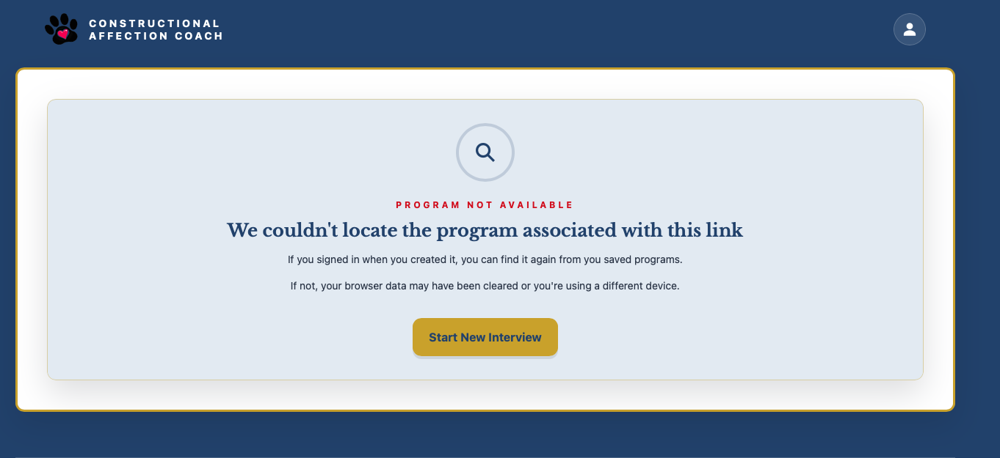
</p>

The application distinguishes between interview failures, invalid routes, and missing resources. When a requested program cannot be found, the user is guided toward the most likely recovery path—returning to their saved programs if authenticated or starting a new interview if the program is no longer available.

### Interview Recovery State

Valid interview/workflow failed

<table>
  <tr>
    <td width="65%" valign="top">
      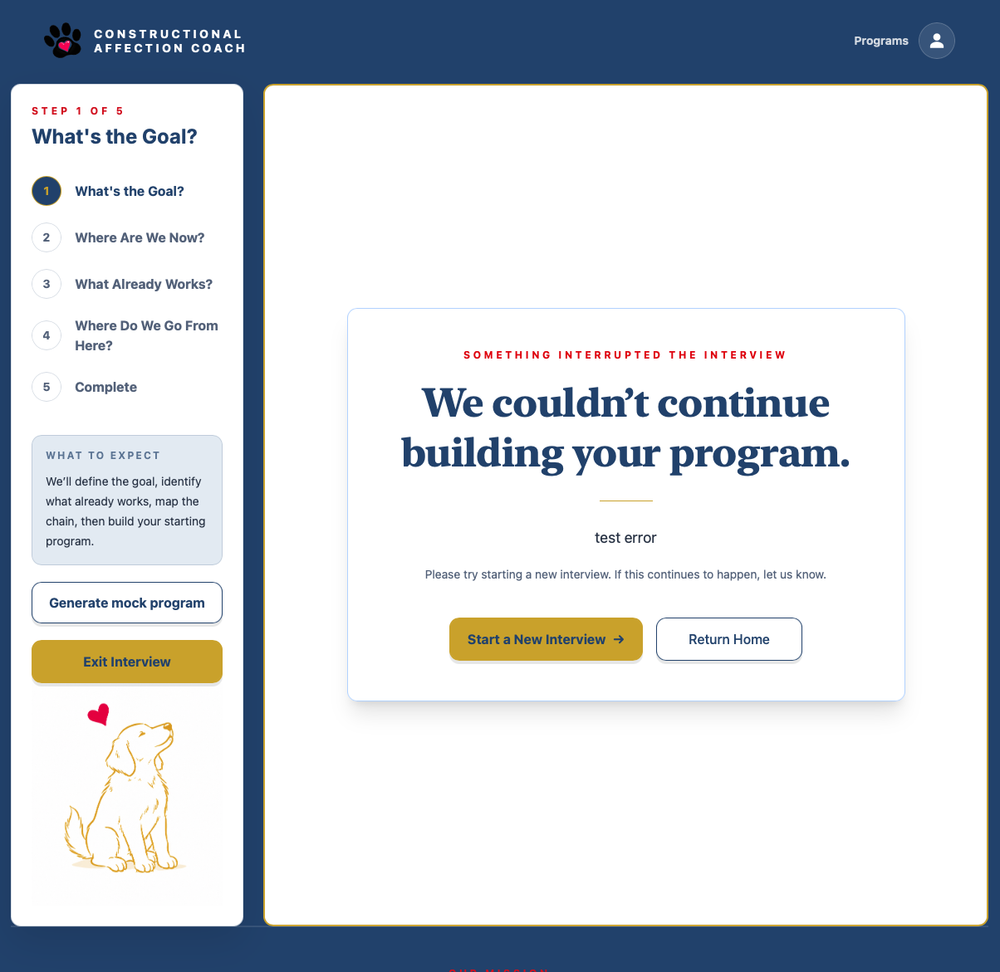
      <p align="center"><strong>Desktop recovery state</strong></p>
    </td>
    <td width="35%" valign="top">
      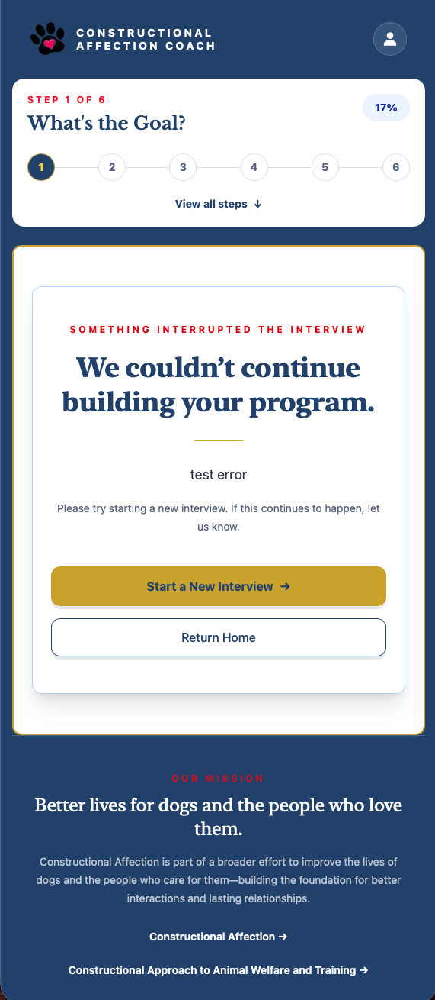
      <p align="center"><strong>Mobile recovery state</strong></p>
    </td>
  </tr>
</table>

### Route and Resource Recovery

Route or requested resource does not exist

<table>
  <tr>
    <td width="65%" valign="top">
      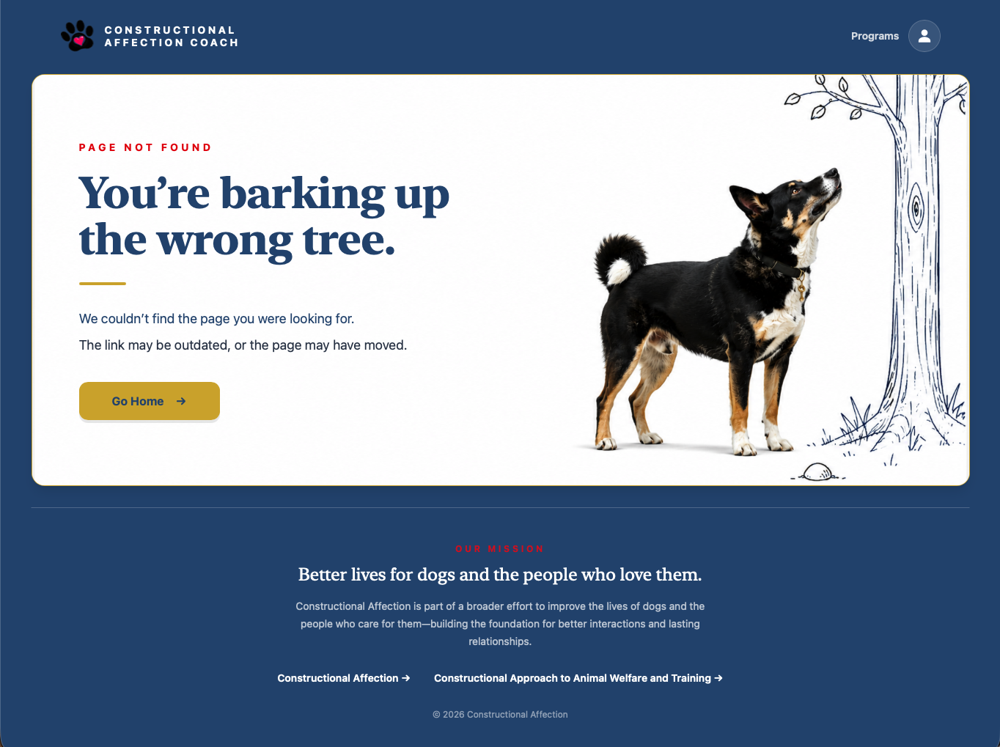
      <p align="center"><strong>Desktop fallback route</strong></p>
    </td>
    <td width="35%" valign="top">
      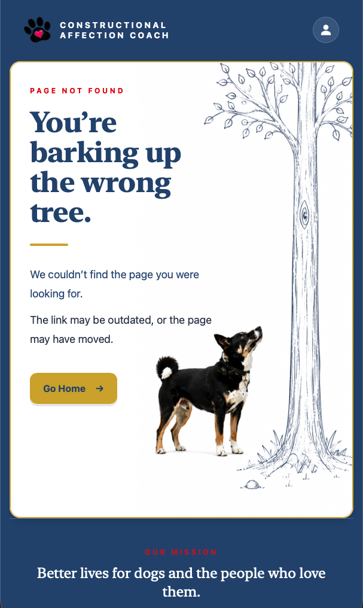
      <p align="center"><strong>Mobile fallback route</strong></p>
    </td>
  </tr>
</table>

These mechanisms allow probabilistic model behavior to be integrated into deterministic application workflows while giving users a clear path to restart or return home when an interview cannot continue.

## Experimentation

Every interview phase is designed to support controlled experimentation.

Phase outputs are versioned with metadata describing:

- implementation version
- schema version
- orchestration strategy
- OpenAI model
- experiment identifier

This allows different methodology revisions, schemas, prompting strategies, orchestration approaches, and models to be compared objectively using deterministic and semantic evaluation tools.

## Development

Install dependencies from the repository root:

```bash
npm install
```

Run the client:

```bash
npm run dev
```

Run workspace type and framework checks:

```bash
npm run check
```

Run linting:

```bash
npm run lint
```

Run tests:

```bash
npm run test
```

Build the workspace:

```bash
npm run build
```

Nx executes the corresponding targets across the appropriate workspace projects.

## Docker

The repository includes a Docker development and validation environment so the workspace can be checked in a reproducible Node.js environment independent of the host machine.

Build the image:

```bash
docker build -t ca-coach .
```

Run workspace checks with the required client environment:

```bash
docker run --rm \
  --env-file constructional-affection-coach/.env \
  ca-coach npm run check
```

The same container can execute other workspace commands by replacing `npm run check`.

## Testing and Quality

The project uses automated checks across the monorepo, including:

- TypeScript type checking
- Svelte diagnostics
- ESLint
- Vitest
- Nx workspace orchestration
- Docker-based environment validation

Pull requests are validated with GitHub Actions.

The `main` branch is protected by repository rules requiring the configured quality checks to pass before changes can be merged.

## CI/CD

GitHub Actions provides continuous integration and deployment.

The deployment workflow uses GitHub OIDC integration with AWS rather than storing long-lived AWS credentials in the repository.

Production deployment includes:

1. validating the workspace
2. building the client
3. authenticating with AWS through OIDC
4. synchronizing the production build to S3
5. invalidating the CloudFront distribution

Branch protection prevents changes with failing required checks from being merged into `main`.

## Observability

The backend includes structured application logging and API access logging through Amazon CloudWatch.

API Gateway access logs capture information including:

- request ID
- route
- HTTP status
- integration status
- integration latency
- integration errors
- response size

Application logging is designed to support tracing failures through interview orchestration, validation, retry handling, and program generation.

## Security

The application uses several AWS security controls:

- private S3 origins
- CloudFront Origin Access Control
- Cognito authentication
- API Gateway authorization
- IAM least-privilege permissions
- Secrets Manager for API credentials
- GitHub Actions OIDC for AWS deployment
- protected production branches

Secrets and environment-specific credentials are not committed to the repository.

## Current Development

The core application is deployed and functional.

Current priorities include:

- completing the lean MCP implementation of all interview phases
- publishing the Constructional Affection MCP server
- continuing deterministic and semantic evaluation tooling
- comparing MCP orchestration with the existing custom orchestration
- expanding methodology versioning and experiment support
- developing participant-facing program execution and coaching capabilities
- developing a Constructional Aggression Treatment workflow for moving from distancing contingencies to nearing contingencies

## Methodology

Constructional Affection approaches behavior change by identifying and constructing desired interaction patterns rather than beginning with the suppression of unwanted behavior.

The application operationalizes that process through a structured interview that identifies:

- the desired interaction
- existing constructional assets
- relevant reinforcers
- interaction sequences
- transfer points
- progressive program stages

For a detailed description of the interview methodology and client behavior, see the README in `constructional-affection-coach/`.

## Author

Built by Chase Owens.

Constructional Affection Coach explores how structured AI systems can support the analysis and construction of individualized Constructional Affection programs.
